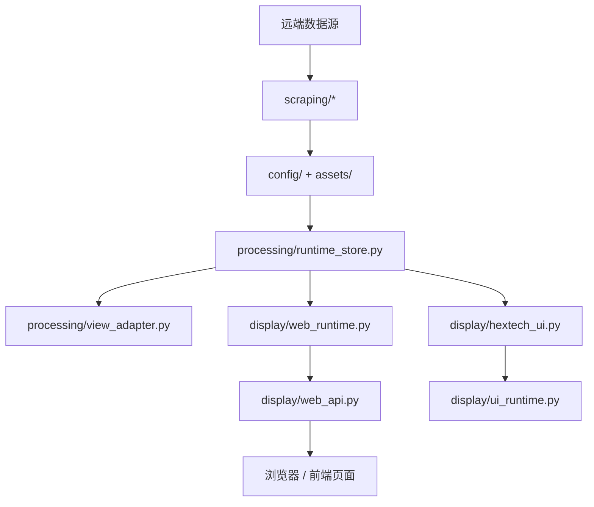

# 项目文档 — qm-run-demo/run

<!-- PROJECT:SECTION:OVERVIEW -->
## 一、项目总览

`qm-run-demo/run/` 是一套 Hextech 伴生系统演示目录，结构与 `run/` 同源，但更适合用于演示、打包和配置对照。

当前项目的主能力包括：

- 桌面伴生界面
- 本地 Web 页面与 API
- 海克斯 / 协同 / 图标数据同步
- 打包、清理、缓存与运行态维护

---

<!-- PROJECT:SECTION:FILES -->
## 二、文件职责清单

| 文件 | 类型 | 职责 |
| :--- | :--- | :--- |
| `build.py` | thin entry | 打包入口薄壳 |
| `hextech_ui.py` | thin entry | 桌面启动入口薄壳 |
| `web_server.py` | thin entry | Web 启动入口薄壳 |
| `Hextech伴生终端.spec` | pack spec | PyInstaller 打包配置 |
| `display/hextech_ui.py` | ui | 桌面 UI 主类与界面结构 |
| `display/ui_runtime.py` | ui runtime | 桌面后台协同、线程、窗口同步、头像加载 |
| `display/web_server.py` | web launcher | Web 启动壳 |
| `display/web_api.py` | web api | FastAPI 路由与接口编排 |
| `display/web_runtime.py` | web runtime | Web 运行时状态、LCU、缓存、浏览器与生命周期 |
| `processing/runtime_store.py` | runtime | 运行时文件定位、CSV 缓存与 DataFrame 归一 |
| `processing/view_adapter.py` | adapter | 首页榜单与海克斯详情数据适配 |
| `processing/precomputed_cache.py` | cache | 预计算 API 缓存 |
| `processing/query_terminal.py` | terminal | 终端查询输出 |
| `processing/alias_search.py` | alias | 首页别名索引读取 |
| `processing/alias_utils.py` | alias | 别名归一与去重 |
| `processing/orchestrator.py` | orchestrator | 后台刷新与自愈统一编排入口 |
| `scraping/version_sync.py` | sync | 稳定资源同步与运行环境引导 |
| `scraping/full_hextech_scraper.py` | scraper | 海克斯数据抓取 |
| `scraping/full_synergy_scraper.py` | scraper | 协同数据抓取 |
| `scraping/augment_catalog.py` | catalog | 海克斯统一目录与预缓存 |
| `scraping/icon_resolver.py` | icon | 海克斯图标查找、缓存与远端回退 |
| `scraping/heal_worker.py` | heal | 缺失产物自愈修复 |
| `tools/build_bundle.py` | build tool | 打包主流程 |
| `tools/bundle_manifest.py` | build tool | 稳定资源白名单生成 |
| `tools/runtime_bundle.py` | runtime tool | 打包后稳定资源播种 |
| `tools/cleanup_runtime.py` | cleanup tool | 构建与运行残留清理 |
| `tools/log_utils.py` | support tool | 统一日志与 UTF-8 输出工具 |
| `tools/dev_checks.py` | dev tool | 本地结构校验与打包契约自检 |
| `config/` | config data | 核心配置、资源映射和版本信息 |
| `assets/` | static assets | 海量英雄 / 海克斯图标资源 |

---

<!-- PROJECT:SECTION:DATAFLOW -->
## 三、数据生产、存储与流转

关键约束：

- Web 热路径只在 `display/web_api.py` 与 `display/web_runtime.py` 之间流动
- 桌面热路径只在 `display/hextech_ui.py` 与 `display/ui_runtime.py` 之间流动
- 纯数据转换统一下沉到 `processing/`
- 远端依赖、稳定资源同步和自愈统一放在 `scraping/`

---

<!-- PROJECT:SECTION:DEPENDENCIES -->
## 四、关键依赖与影响范围

| 改动文件 | 直接影响 | 主要级联影响 | 审计关注点 |
| :--- | :--- | :--- | :--- |
| `display/web_server.py` | 起服方式 | 根级薄壳入口 | 启动兼容性 |
| `display/web_api.py` | HTTP / WS 接口行为 | 前端页面、桌面跳转 | 返回结构与路由稳定性 |
| `display/web_runtime.py` | LCU、缓存、资源回退 | Web 热路径与浏览器托管 | 线程 / 协程 / 重复读取 |
| `display/hextech_ui.py` | 桌面 UI 结构 | 根级入口薄壳 | 交互一致性 |
| `display/ui_runtime.py` | 桌面后台协同 | LCU 联动、Web 协同、头像缓存 | 重复下载与线程负担 |
| `tools/build_bundle.py` | 打包产物结构 | 离线可用性 | 白名单完整性与资源播种 |
| `Hextech伴生终端.spec` | 打包方式 | 便携包分发形态 | spec 与实际入口是否一致 |

---

<!-- PROJECT:SECTION:ISSUES -->
## 五、已知问题、风险与技术债务

| 编号 | 类型 | 问题描述 | 影响文件 | 优先级 | 状态 | 建议方案 |
| :--- | :--- | :--- | :--- | :--- | :--- | :--- |
| TD-001 | 双目录同步 | `run/` 与 `qm-run-demo/run/` 同源但不完全同步，后续改动容易只修一边 | 两个运行目录 | 中 | 待关注 | 以后涉及共用结构时同步维护两套 `PROJECT.md` |
| TD-002 | 兼容薄壳 | 根级入口仍保留兼容壳职责 | `build.py`、`hextech_ui.py`、`web_server.py` | 中 | 已知 | 保持薄壳，仅做委托 |
| ARCH-001 | 大量静态资源 | `assets/` 体积大、资源名多，文档与真实资源目录容易漂移 | `assets/`、`config/` | 低 | 已知 | 定期抽样核对 manifest 与实际资源 |

---

<!-- PROJECT:SECTION:CHANGELOG -->
## 六、变更记录

| 日期 | task_id | 执行端 | 最终改动 | 最终有效范围 | 范围变动/新增需求 | 遗留债务 | 审计结果 | 备注 |
| :--- | :--- | :--- | :--- | :--- | :--- | :--- | :--- | :--- |
| 2026-04-12 | cx-task-qm-run-demo-project-doc-refresh-20260412 | cx | 按新模板收口 `qm-run-demo/run/` 项目文档，补齐文件职责与风险说明 | `qm-run-demo/run/PROJECT.md` | 无 | TD-001, TD-002, ARCH-001 | pending | 本轮只更新文档，不调整运行逻辑 |

---

<!-- PROJECT:SECTION:MAINTENANCE -->
## 七、维护规则

- 新增 Web 路由优先落在 `display/web_api.py`
- 新增 Web 生命周期、LCU、缓存、端口或浏览器逻辑优先落在 `display/web_runtime.py`
- 新增桌面线程、轮询、跳转和资源加载逻辑优先落在 `display/ui_runtime.py`
- 纯数据转换优先落在 `processing/`
- 远端抓取和资源同步逻辑优先落在 `scraping/`
- 变更打包链路时必须同步检查 `Hextech伴生终端.spec` 与 `tools/build_bundle.py`
- 变更目录结构或职责边界时，必须同步更新本文件
