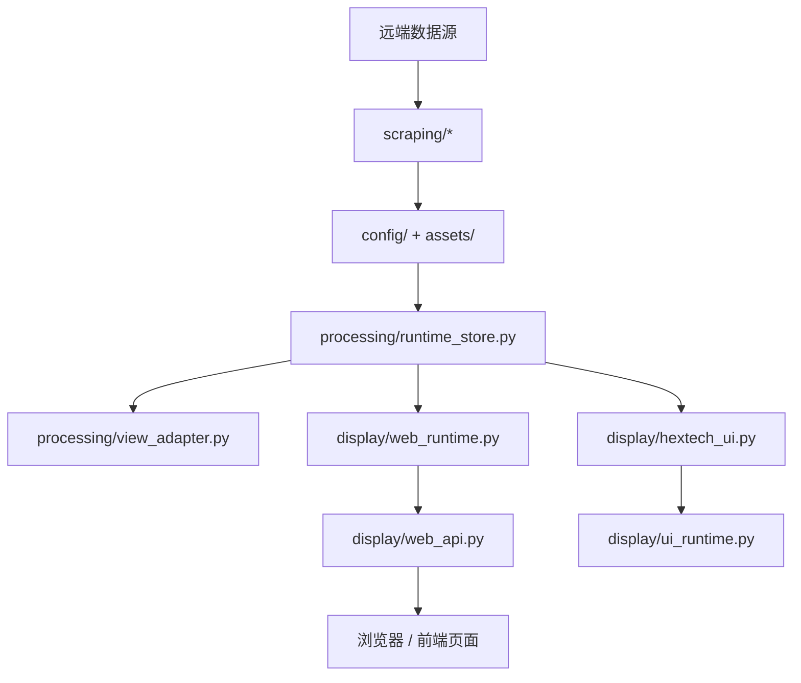

# Hextech 伴生系统项目文档

<!-- PROJECT:SECTION:OVERVIEW -->
## 一、项目总览

Hextech 伴生系统是一个本地运行的《英雄联盟》数据查询工具，目标是把英雄基础资料、海克斯数据、协同数据和图标资源同步到本地，并通过桌面界面和 Web 页面提供快速查询。

### 1. 当前架构方向

- 入口兼容保持不变：`build.py`、`hextech_ui.py`、`web_server.py`
- 展示层按性能优先拆为：
  - Web 启动壳
  - Web 路由层
  - Web 运行时层
  - 桌面 UI 主类
  - 桌面运行时辅助层
- 数据与抓取链路继续分为：
  - `processing/`：本地数据处理
  - `scraping/`：远端抓取、自愈和稳定资源同步
  - `tools/`：开发、构建与发布工具
- Python 模块统一采用“模块头注释 + 关键函数短 docstring”维护规范

### 2. 核心功能

- 自动同步英雄核心资料、海克斯排行榜、协同数据与图标目录
- 提供桌面伴生界面，跟随游戏窗口状态显示或隐藏
- 提供本地 Web 页面、HTTP API 与 WebSocket 事件推送
- 支持冷启动快照回退、图标本地缓存与远端兜底
- 打包时内置稳定基础资源，高频数据保留为运行时刷新

---

<!-- PROJECT:SECTION:FILES -->
## 二、文件职责清单

### 1. 顶层入口

| 文件 | 类型 | 职责 |
| :--- | :--- | :--- |
| `build.py` | thin entry | 打包入口薄壳，委托 `tools.build_bundle` |
| `hextech_ui.py` | thin entry | 桌面启动薄壳，委托 `display.hextech_ui` |
| `web_server.py` | thin entry | Web 启动薄壳，委托 `display.web_server` |

### 2. 展示层

| 文件 | 类型 | 职责 |
| :--- | :--- | :--- |
| `display/hextech_ui.py` | ui | 桌面 UI 主类、控件结构与交互入口 |
| `display/ui_runtime.py` | ui runtime | 桌面端后台线程、LCU 轮询、窗口同步、头像加载 |
| `display/web_server.py` | web launcher | FastAPI 应用创建与 Uvicorn 启动 |
| `display/web_api.py` | web api | 路由、请求模型与接口编排 |
| `display/web_runtime.py` | web runtime | Web 生命周期、LCU、缓存、浏览器与资源回退 |

### 3. 数据处理层

| 文件 | 类型 | 职责 |
| :--- | :--- | :--- |
| `processing/runtime_store.py` | runtime | CSV 与运行时文件定位、DataFrame 缓存与归一 |
| `processing/view_adapter.py` | adapter | 首页榜单与海克斯详情数据适配 |
| `processing/precomputed_cache.py` | cache | 预计算 API 缓存读写 |
| `processing/query_terminal.py` | terminal | 终端查询输出 |
| `processing/alias_search.py` | alias | 首页别名索引读取 |
| `processing/alias_utils.py` | alias | 别名归一与去重 |
| `processing/orchestrator.py` | orchestrator | 后台刷新、自愈与缓存重建编排 |

### 4. 抓取与自愈层

| 文件 | 类型 | 职责 |
| :--- | :--- | :--- |
| `scraping/version_sync.py` | sync | 稳定资源同步与运行环境引导 |
| `scraping/full_hextech_scraper.py` | scraper | 海克斯数据抓取 |
| `scraping/full_synergy_scraper.py` | scraper | 协同数据抓取 |
| `scraping/augment_catalog.py` | catalog | 海克斯统一目录维护与预缓存 |
| `scraping/icon_resolver.py` | icon | 海克斯图标查找、缓存与远端兜底 |
| `scraping/heal_worker.py` | heal | 缺失关键产物自愈修复 |
| `scraping/augment_common.py` | helper | 海克斯目录公共辅助 |

### 5. 工具层

| 文件 | 类型 | 职责 |
| :--- | :--- | :--- |
| `tools/build_bundle.py` | build tool | 打包主流程、版本文件和产物整理 |
| `tools/bundle_manifest.py` | build tool | 稳定资源白名单与 manifest 生成 |
| `tools/runtime_bundle.py` | runtime tool | 打包后稳定资源播种 |
| `tools/cleanup_runtime.py` | cleanup tool | 构建和运行态残留清理 |
| `tools/log_utils.py` | support tool | 日志过滤、source 标识、UTF-8 输出 |
| `tools/dev_checks.py` | dev tool | 本地结构与构建契约自检 |

---

<!-- PROJECT:SECTION:DATAFLOW -->
## 三、数据生产、存储与流转

关键约束：

- Web 热路径只在 `display/web_api.py` 与 `display/web_runtime.py` 之间流动
- 桌面热路径只在 `display/hextech_ui.py` 与 `display/ui_runtime.py` 之间流动
- 纯数据转换统一下沉到 `processing/`
- 远端依赖、稳定资源同步和自愈统一放在 `scraping/`

---

<!-- PROJECT:SECTION:DEPENDENCIES -->
## 四、关键依赖与影响范围

| 改动文件 | 直接影响 | 主要级联影响 | 审计关注点 |
| :--- | :--- | :--- | :--- |
| `display/web_server.py` | 起服方式与端口写回 | 根级 `web_server.py` | 启动入口兼容 |
| `display/web_api.py` | HTTP / WS 接口行为 | 前端页面、桌面跳转 | 路由兼容、返回结构 |
| `display/web_runtime.py` | LCU、缓存、资源回退 | Web 热路径与浏览器托管 | 重复读取、线程/协程数量 |
| `display/hextech_ui.py` | 桌面 UI 结构 | 根级 `hextech_ui.py` | 交互行为、状态保持 |
| `display/ui_runtime.py` | 桌面后台协同 | LCU 联动、Web 协同、头像缓存 | 线程数、重复下载 |
| `tools/build_bundle.py` | 打包产物结构 | 离线可用性 | 白名单完整性 |

---

<!-- PROJECT:SECTION:ISSUES -->
## 五、已知问题、风险与技术债务

| 编号 | 类型 | 问题描述 | 影响文件 | 优先级 | 状态 | 建议方案 |
| :--- | :--- | :--- | :--- | :--- | :--- | :--- |
| TD-001 | 文档漂移 | 历史文档曾残留 `app/services` 结构描述，与当前真实代码不一致 | `README.md`、`PROJECT.md` | 高 | 已处理 | 以后按真实目录更新文档 |
| TD-002 | 兼容薄壳保留 | 根级入口仍保留兼容壳职责 | `build.py`、`hextech_ui.py`、`web_server.py` | 中 | 已知 | 保持薄壳，仅做委托 |
| ARCH-001 | 运行时混合资源 | 稳定资源与高频刷新数据仍同时存在 | `config/`、`assets/`、`scraping/version_sync.py` | 中 | 待关注 | 保持 schema 兼容并持续做冷启动回归 |

---

<!-- PROJECT:SECTION:CHANGELOG -->
## 六、变更记录

| 日期 | workflow_id | 执行端 | 变更原因 | 变更摘要 | 影响文件 | 审计结果 | 备注 |
| :--- | :--- | :--- | :--- | :--- | :--- | :--- | :--- |
| 2026-04-11 | cx-run-web-ui-performance-refactor | cx | Web / UI 结构收口、注释统一、文档同步 | 将 Web 拆为启动壳 / 路由层 / 运行时层，将桌面端拆为 UI 主类 / 运行时辅助层，修正 `dev_checks.py` 执行入口，并把 `README.md` / `PROJECT.md` 更新为当前真实结构 | `display/web_server.py`、`display/web_api.py`、`display/web_runtime.py`、`display/hextech_ui.py`、`display/ui_runtime.py`、`tools/dev_checks.py`、`README.md`、`PROJECT.md` | passed | 已完成编译、自检与导入验证 |
| 2026-04-11 | cx-run-commentary-and-doc-harden | cx | 为 `run/` Python 模块补统一模块头和关键函数说明，收紧运行与打包文档 | 统一补充 Web 生命周期、LCU 轮询、CSV/快照读取、UI 后台线程、资源缓存回退和打包主流程的 docstring，并同步维护文档说明 | `display/web_runtime.py`、`display/ui_runtime.py`、`processing/runtime_store.py`、`processing/orchestrator.py`、`scraping/version_sync.py`、`scraping/icon_resolver.py`、`tools/build_bundle.py`、`tools/bundle_manifest.py`、`tools/runtime_bundle.py`、`README.md`、`PROJECT.md` | pending | 本轮只改注释与文档，不调整运行逻辑 |

---

<!-- PROJECT:SECTION:MAINTENANCE -->
## 七、维护规则

- 新增 Web 路由优先落在 `display/web_api.py`
- 新增 Web 生命周期、LCU、缓存、端口或浏览器逻辑优先落在 `display/web_runtime.py`
- 新增桌面线程、轮询、跳转和资源加载逻辑优先落在 `display/ui_runtime.py`
- `display/hextech_ui.py` 只保留 UI 结构、状态和交互入口，不继续堆积后台流程
- 纯数据转换、DataFrame 清洗、终端展示适配优先落在 `processing/`
- 远端抓取、图标目录维护、稳定资源同步和自愈逻辑优先落在 `scraping/`
- 变更打包链路时，必须同步更新 `tools/build_bundle.py`、`tools/bundle_manifest.py`、`tools/runtime_bundle.py` 与 `README.md`
- 变更目录结构或职责边界时，必须同步更新本文件与 `README.md`
